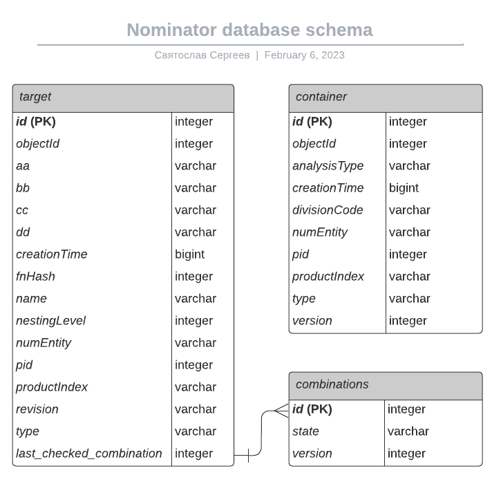

# Nominator
Сервис для генерации имен "по-умолчанию"</br>
Текущая версия (<i>2023.1.20.02</i>) предусматривает возможность создания имен для объектов, создаваемых в:
* дереве проекта, 
* библиотеке требований,
* сервисе генерации имен,
* сервисе виртуальных датчиков
<hr>


* [Запуск приложения](#Запуск-приложения)</br>
* [Используемые properties](#Используемые-properties)</br>
  * [Прим.: Service Discovery](#Service-Discovery)</br>
* [API](#API)</br>
  * [Контейнерные элементы](#Контейнерные-элементы)</br>
    - [Предварительное формирование имени](#Предварительное-формирование-имени-контейнера)</br>
    - [Создание контейнера с пользовательским именем](#Создание-контейнера-с-пользовательским-именем)</br>
  * [Таргеты](#Таргеты)</br>
    - [Предварительное формирование имени](#Предварительное-формирование-имени-таргета)</br>
    - [Создание таргета с пользовательским именем](#Создание-таргета-с-пользовательским-именем)</br>
    - [Взаимодействие со словарем функционального номера](#Взаимодействие-со-словарем-для-формирования-функционального-номера)
    - [Обновление номера ревизии](#Обновление-номера-ревизии)</br>
  * [Удаление](#Удаление)</br>
    - [Удаление объектов по идентификатору](#Удаление-объектов-по-идентификатору)</br>
    - [Удаление всех записей из таблицы](#Удаление-всех-записей-из-таблицы)</br>
  * [Генератор имен доменов, сеточных регионов и названий параметров](#Генератор-имен-доменов,-регионов,-названий)
  * [Генератор имен виртуальных датчиков](#Генератор-имен-виртуальных-датчиков) 
  * [Хелсчек](#Хелсчек)
* [Используемые базы данных](#Используемые-базы-данных)
* [Что нового](#Что-нового)

### Запуск приложения
```
java -jar -DPATH_TO_PROP=Path:\to\custom.properties Path:\to\app.jar
```

### Используемые properties
| Переменная                           | Значение по-умолчанию                       | Изменяемый | Примечание                                                      |
|--------------------------------------|---------------------------------------------|:----------:|-----------------------------------------------------------------|
| spring.config.import                 | ${PATH_TO_PROP}                             |     +      | Путь к пользовательскому файлу свойств                          |
| server.port                          | 9000                                        |     +      |                                                                 |
| application.name                     | name-classifier                             |     -      |                                                                 |
| application.version                  | 2023.1.0                                    |     -      |                                                                 |
| application.environment              | dev                                         |     +      | альтернативное значение application.environment='prod'          |
| logging.file.name                    | -                                           |     +      | путь к файлу лога                                               |
| url.controller.prefix                | /classifier                                 |     -      | префикс по-умолчанию для всех запросов                          |
| eureka.client.enabled                | false                                       |     +      | взаимодействие с сервером eureka (service discovery)            |
| eureka.client.serviceUrl.defaultZone | -                                           |     +      | адрес сервера eureka                                            |
| app.database.users.driver            | org.postgresql.Driver                       |     -      |                                                                 |
| app.database.users.username          |                                             |     +      | имя пользователя для подключения к БД cml_core_db               |
| app.database.users.password          |                                             |     +      | пароль для подключения к БД cml_core_db                         |
| app.database.users.url               |                                             |     +      | url БД cml_core_db                                              |
| app.database.users.prefix            | jdbc:postgresql:                            |     -      |                                                                 |
| app.database.users.dialect           | org.hibernate.dialect.PostgreSQL10Dialect   |     -      |                                                                 |
| app.database.elements.driver         | org.sqlite.JDBC                             |     -      |                                                                 |
| app.database.elements.username       | -                                           |     -      | имя пользователя для подключения к собственной БД приложения    |
| app.database.elements.password       | -                                           |     -      | пароль для подключения к собственной БД приложения              |
| app.database.elements.prefix         | jdbc:sqlite:                                |     -      |                                                                 |
| app.database.elements.url            | -                                           |     +      | путь к файлу собственной БД приложения                          |
| app.database.elements.dialect        | <..>/config.database.elements.SQLiteDialect |     -      |                                                                 |
| path.dictionaries.fn                 | /etc/nominator-server/dict/fn               |     +      | путь к папке, содержащей словари функционального номера         |
| path.dictionaries.domain             | /etc/nominator-server/dict/domain           |     +      | путь к папке, содержащей словари генератора имен доменов        |
| path.dictionaries.virtualsensor      | /etc/nominator-server/dict/virtualsensor    |     +      | путь к папке, содержащей словари генератора имен вирт. датчиков |
| app.database.targetlibrary.driver    | org.postgresql.Driver                       |     -      |                                                                 |
| app.database.targetlibrary.username  |                                             |     +      | имя пользователя для подключения к БД cml_tl_db                 |
| app.database.targetlibrary.password  |                                             |     +      | пароль для подключения к БД cml_tl_db                           |
| app.database.targetlibrary.url       |                                             |     +      | url БД cml_tl_db                                                |
| app.database.targetlibrary.prefix    | jdbc:postgresql:                            |     -      |                                                                 |
| app.database.targetlibrary.dialect   | org.hibernate.dialect.PostgreSQL10Dialect   |     -      |                                                                 |
| services.properties.container.entity-index-length   | 5                            |     +      | Количество символов в номере сущности на текущем уровне         |

Все параметры, не имеющие значений по-умолчанию, должны быть переопределены в .properties-файле, 
путь к которому указан в переменной PATH_TO_PROP (в противном случае приложение не запустится).</br>
Формат пути на данный момент `opt/nominator-server/...` - без первого слеша</br>

#### Примечания по значениям свойств
* Альтернативное значение <b>application.environment=prod</b> запрещает выполнение delete-запроса 
  на http://app.ip/classifier/container<or>target, который удаляет все записи из соответствующей таблицы
* Значение для <b>app.database.users.url</b>, если это IP, указывать именно в таком формате, с двумя слешами - //192...
* Изменение значения <b>eureka.client.enabled</b> на <i>true</i> требует указания адреса 
  eureka-сервера в <b>eureka.client.serviceUrl.defaultZone</b>

### Service Discovery
Сервис отображается в service-discovery, н реализация отличается от имеющейся сейчас у сервисов бенча.</br>
Можно переделать на аналогичную, но для этого как-то подтянуть из артифактори джарник service-discovery-client, 
плюс в bench-core добавить упоминание клиента сервиса в ServiceDiscoveryAwareRemoteServicesConfig
***


## API
### Контейнерные элементы
#### Предварительное формирование имени контейнера
Все запросы на предварительное формирование имени отправляются при нажатии правой кнопкой в дереве и выборе команды "Create..."

Request: <b>POST</b> `http://ip:port/classifier/container/suggest`</br>
Body: ContainerSuggest
```
{
  "type": "string",
  "action": "suggest",
  "uid": int,
  "parent": {
    "id": Integer,
    "type": "string"
  }
}
```
* <i>type</i> - тип создаваемого элемента ("folder", "loadcase"...);
* <i>parent</i> - IdentityData
  * <i>parent.id, parent.type</i> - (nullable) идентификатор и тип родительской сущности;
* <i>uid</i> - идентификатор пользователя.

Response: ContainerOut + HttpStatus.201
```
{
  "divisionCode": "string",
  "productIndex": "string",
  "analysisType": "string",
  "numEntity": "string",
  "type": "string",
  "version": "string",
  "classifierEnabled": boolean,
  "classifierAvailable": boolean
}
```
* <i>divisionCode</i> - значение атрибута <i>postalCode</i> из AD соответствующего пользователя, "None" при отсутствии;
* <i>productIndex</i> - null для корневых элементов;
* <i>analysisType</i> - null для корневых элементов;
* <i>type</i> - форматированный тип создаваемого элемента (в соответствии с NamedObjectTypes);
* <i>classifierEnabled</i> - определяет, включен ли чекбокс (включена галочка или нет)
* <i>classifierAvailable</i> - определяет, доступен ли чекбокс для изменения пользователем (активен чекбокс или нет)
  


#### Создание контейнера с пользовательским именем
Request: <b>POST</b> `http://ip:port/classifier/container`</br>
Body: ContainerCreate
```
{
  "type": "string",
  "action": "create",
  "id": int,
  "divisionCode": "string",
  "productIndex": "string",
  "analysisType": "string",
  "parent": {
	"id": Integer,
    "type": "string"
  }
}
```
* <i>divisionCode, productIndex, analysisType, type</i> - заполняются данными из ответа на suggest-запрос
* <i>parent</i> - null для корневых объектов в дереве 'Home environment'

Response: Http.status.200


### Таргеты
#### Предварительное формирование имени таргета
Request: <b>POST</b> `http://ip:port/classifier/target/suggest`</br>
Body: TargetSuggest
```
{
  "type": "string",
  "action": "suggest",
  "parent": {
    "id": Integer,
    "type": "string"
  }
}
```
* <i>parent</i> - IdentityData
  * <i>parent.id, parent.type</i> - (nullable) идентификатор и тип родительской сущности;
* <i>type</i> - тип создаваемого элемента - "target" или "targetgtoup"; </br>

Response: TargetOut + HttpStatus.201

Объект <b>TargetOut</b> состоит из двух объектов - TargetShort + List<CodeNaimPair>

* <i>TargetShort</i> (json-поле <i>target</i>) для корневых элементов содержит значения полей по-умолчанию,
  для всех остальных будет содержать унаследованные от родительской сущности свойства
* <i>List< CodeNamePair ></i> (json-поле <i>dict</i>) представляет собой содержимое словаря, 
  соответствующее унаследованному функциональному номеру создаваемой сущности
  
<i>Например:</i><br>
объект TargetOut для корневого элемента:
```
{
  "target": {
    "productIndex": null,
    "fn": {},
    "revision": "00" <or> null,
    "numEntity": "0001",
    "classifierEnabled": false,
    "classifierAvailable": true <or> false
  },
  "dict": [
    {
      "code": "71",
      "name": "Силовая установка"
    },
    ...
    {
      "code": "80",
      "name": "Система запуска двигателя"
    }
  ]
}
```
* <i>revision</i> - null для targetgroup, '00' для target;
* <i>dict</i> - первый уровень словаря функционального номера, представленный в виде списка 
  объектов класса CodeNamePair;
* <i>classifierAvailable</i> - для корневых элементов в общем дереве - false, в приватном дереве - true.

<i>объект TargetOut для вложенного элемента, родительская сущность которого имеет функциональный номер 72-00:</i>
```
{
  "target": {
    "productIndex": "string",
    "fn": {
      "AA": {
        "code": "72",
        "name": "Двигатель"
      }
    },
    "revision": "00" <or> null,
    "numEntity": "0001",
    "classifierEnabled": true,
    "classifierAvailable": false
  },
  "dict": [
    {
      "code": "10",
      "name": "Редуктор, вал"
    },
    {
      "code": "20",
      "name": "Воздухозаборник"
    },
    ...
    {
      "code": "00",
      "name": "Общие сведения"
    }
  ]
}
```
* <i>fn</i> - наследуемые от родительской сущности элементы функционального номера;
* <i>dict</i> - уровень словаря, соответствующий унаследованным элементам функционального номера

Наследование блоков функционального номера происходит по следующей схеме:</br>
```
├─ Корневой элемент - может иметь любое количество заполненных блоков ФН
    └─ I уровень вложенности - наследует блок 'AA' функционального номера корневого элемента
        └─ II уровень - 'AA' корневого элемента + 'BB' элемента I уровня
            └─ III уровень - 'AA' + 'BB' + 'CC' элемента II уровня
```
Элементы последующих уровней вложенности наследуют блоки ФН по схеме для III уровня


#### Создание таргета с пользовательским именем
Request: <b>POST</b> `http://ip:port/classifier/target`</br>
Body: TargetCreate
```
{
  "type": "targetGroup" <or> "target",
  "action": "create",
  "id": int,
  "productIndex": "string",
  "fn": {
    "AA": "XX",
    "BB": "XX",
    "CC": "XX",
    "DD": "XX"
    }
  },
  "name": "string",
  "parent": {
    "id": Integer,
    "type": "string"
  }
}
```
* <i>id</i> - objectId создаваемого объекта
* <i>productIndex</i> - заполняется данными из ответа на suggest-запрос;
* <i>name, fn</i> - формируется в пользовательской форме;
* <i>"XX"</i> - числовой код категории словаря. Заполняется в соответствии со значениями комбобоксов в пользовательской форме.
  При отсутствии значения поле может отсутствовать в запросе;

Response: Http.status.200


#### Взаимодействие со словарем для формирования функционального номера
Request: <b>POST</b> `http://ip:port/classifier/target/dic`</br>
Body: FunctionalNumberDictionaryRequest
```
{
  "project": "string",
  "fields": {
    "aa": "string",
    "bb": "string",
    "cc": "string",
    "dd": "string"
  }
}
```


Response: TargetOut + Http.status.200

* <i>TargetShort</i> (json-поле <i>target</i>) содержит актуальный номер сущности на текущем уровне (numEntity)
* <i>List< CodeNamePair ></i> (json-поле <i>dict</i>)представляет собой содержимое словаря, соответствующее указанным параметрам ('aa', 'bb'...)

Поля в теле запроса необязательны, то есть:
* запрос с пустым телом `{}` вернет список номеров проектов, для которых существуют словари функционального номера, а так же значение по-умолчанию номера сущности:

```
{
  "target": {
    "productIndex": null,
    "fn": null,
    "revision": null,
    "numEntity": "0001"
  },
  "dict": [
    {
      "code": "105",
      "name": "105"
    },
    {
      "code": "P90",
      "name": "П-90"
    },
    {
      "code": "CD91",
      "name": "ЦД-91"
    }
  ]
}
```
* добавление полей в тело запроса возвращает соответствующий уровень словаря и уточненный номер сущности.
  Например, при наличии в проекте ЦД-91 двух ранее созданных объектов с функциональным номером '72-32',
  запрос с телом вида:
```
{
  "project": "cd91",
  "fields": {
    "aa": "72",
    "bb": "32"
  }
}
```
возвращает содержимое блока "Двигатель — КВД" и '0003' для номера сущности:
```
{
  "target": {
    "productIndex": null,
    "fn": null,
    "revision": null,
    "numEntity": "0003"
  },
  "dict": [
    {
      "code": "01",
      "name": "Ротор"
    },
    {
      "code": "02",
      "name": "Статор"
    }
    {
      "code": "03",
      "name": "Подшипник"
    }
  ]
}
```
* В случае, когда словарь для выбранных элементов пуст, сервис вернет пустой список и актуальный номер сущности:
```
{
  "target": {
    "productIndex": null,
    "fn": null,
    "revision": null,
    "numEntity": "0001"
  },
  "dict": []
}
```


#### Обновление номера ревизии
Обновление номера ревизии таргета происходит в двух случаях:
 1. при создании новой версии таргета (нажатие на кнопку <i>Save</i> на вкладке <i>Value</i>):

* Request: <b>PUT</b> `http://ip:port/classifier/target/{objectId}`</br>
  - <i>{objectId}</i> - идентификатор таргета, для которого создается новая версия;
* Response: Http.status.200

 2. при нажатии на кнопку <i>TargetLibrary</i> в верхнем меню:
* Request: <b>PUT</b> `http://ip:port/classifier/target`</br>
* Response: Http.status.200
    


### Удаление
#### Удаление объектов по идентификатору
> Оба запроса работают. Предпочтительнее второй

Request: <b>DELETE</b> `http://ip:port/classifier/{table}/{type}/{objectId}`</br>
* <i>{table}</i> - имя таблицы, из которой производится удаление - 'container', 'target'
* <i>{type}</i> - тип удаляемого элемента в соответствии с NamedObjectTypes
* <i>{objectId}</i> - идентификатор удаляемой сущности

Response: Http.status.204

Request: <b>DELETE</b> `http://ip:port/classifier/{table}`</br>
Body: IdentityData
```
{
  "id": Integer,
  "type": "string"
}
```

* <i>{type}</i> - тип удаляемого элемента в соответствии с 'fullName' NamedObjectTypes
* <i>{id}</i> - идентификатор удаляемой сущности

Response: Http.status.204


#### Удаление всех записей из таблицы
>Недоступно при `application.environment=prod`
 
Request: <b>DELETE</b> `http://ip:port/classifier/{table_name}/all`</br>
Response: Http.status.204


### Генератор имен доменов, регионов, названий
Request: <b>GET</b> `http://ip:port/classifier/dic/domain?name={dictionary}` </br>
 * <i>dictionary</i> - имя словаря. Должно соответствовать представленной ниже схеме:

| Параметр запроса | Соответствующий словарь     | Файл словаря   |
|------------------|-----------------------------|----------------|
| node             | Имена узлов                 | node.json      |
| detail           | Имена деталей               | detail.json    |
| domain           | Тип домена                  | domain.json    |
| surface          | Тип поверхности             | surface.json   |
| rotation         | Наличие вращения            | rotation.json  |
| location         | Характеристика расположения | location.json  |
| parameter        | Тип параметра               | parameter.json |
| index            | Индексы                     | index.json     |

Имена json-файлов словарей **не менять**, так как при парсинге словарей их названия берутся из названий файлов</br> 


  Response: Http.status.200 + DomainDictionaryObject[] </br>

Пример тела ответа для запроса на адрес `/classifier/dic/domain?name=detail`
```
[
  {
    "short":"AZ",
    "full":"Аппарат закрутки"
  },
  {
    "short":"OPK",
    "full":"Обтекатель переходного канала"
  },
  ...
  {
    "short":"BRN",
    "full":"Подшипник"
  }
]
```

### Генератор имен виртуальных датчиков

Request: <b>GET</b> `http://ip:port/classifier/dic/virtualSensor?name={dictionary}` </br>
* <i>dictionary</i> - имя словаря. Должно соответствовать представленной ниже схеме:

| Параметр запроса     | Соответствующий словарь  | Файл словаря              |
|----------------------|--------------------------|---------------------------|
| classificationGroups | Классификационная группа | classificationGroups.json |
| controlSection       | Контрольная секция       | controlSection.json       |
| measuredParameter    | Измеряемый параметр      | measuredParameter.json    |
| units                | Единицы измерения        | units.json                |

  Response: Http.status.200 + VirtualSensorDictionaryObject[] </br>

Тело ответа на запрос аналогично ответу для генератора имен доменов

### Хелсчек
Request: <b>GET</b> `http://ip:port/classifier` </br>
Response: Http.status.200 + текстовое сообщение, содержащее номер версии и значение переменной <i>application.environment</i> </br>

Так же проверка статуса приложения доступна через запрос к service discovery


### Используемые базы данных
* <b>cml_core_db</b> - подключение только на чтение для доступа к значениям из таблиц <i>users</i>, <i>approvals</i>, <i>approval_assignees</i></br>
* <b>cml_tl_db</b> - подключение на чтение/запись для доступа к таблицам <i>target</i> и <i>target_value</i></br>
* <b>nominatorDb.db</b> - имя по-умолчанию для создаваемого файла собственной БД приложения. Схема таблиц БД и связей приведена ниже




## Что нового
### Версия 2023.1
#### DevOps
* Переменная <b>path.dictionaries.fn</b> теперь должна указывать путь к папке (а не конкретному файлу), содержащей json-словари функционального номера;
* Обновлена структура всех файлов словарей. Файлы необходимо обновить, актуальные версии - в папке <b>/dictionary</b>;
* Добавлены новые json-словари для сервиса генерации имен виртуальных датчиков (4 шт.).
  Актуальные версии - в папке <b>/dictionary/virtualsensor</b>;
* Добавлена переменная <b>path.dictionaries.virtualsensor</b>, указывающая путь к папке, содержащей
  json-словари генератора имен виртуальных датчиков;
* В application.properties добавлена переменная <b>services.properties.container.entity-index-length</b> (int),
  определяющая количество символов в номере сущности при создании контейнерных элементов. Значение по умолчанию: 5.
* Перед запуском приложения необходимо удалить старый файл БД;
#### API
* Взаимодействие со словарем функционального номера:
  * Вместо GET /target/dic?aa=AA&bb=BB&cc=CC&dd=DD теперь POST /target/dic c FunctionalNumberDictionaryRequest
в теле;
* Добавлено API для взаимодействия со словарем генератора имен виртуальных датчиков:
  * GET /dic/virtualSensor?name={dictionaryName}
* В ответ на suggest-запрос при создании контейнеров и таргетов добавлены поля <b>classifierEnabled</b>
  и <b>classifierAvailable</b>
#### BE
* Исправлена ошибка формирования номера сущности на текущем уровне (NNNN для объектов target library).
* Добавлена новая логика формирования номера сущности на текущем уровне для проектов в общем дереве.
* Добавлена логика определения состояния чекбокса "Включить классификатор" (в модальном окне создания объекта)
  как для контейнерных объектов, так и для объектов библиотеки ЦЗ
  

